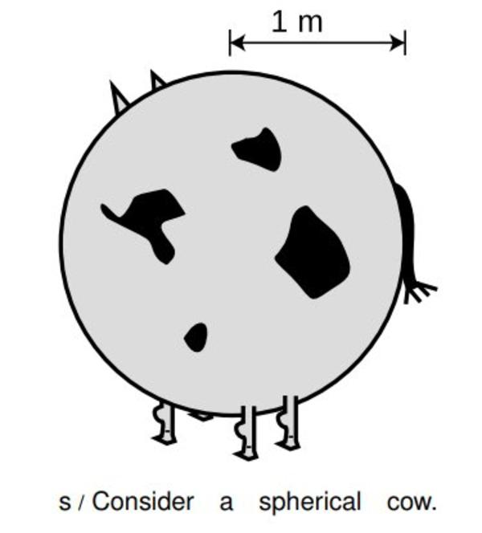
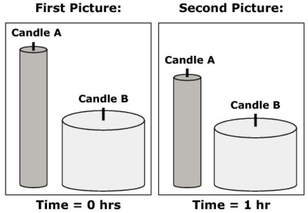

= Applied Mathematics: Examples   
Dr. Sam Macharia <https://orcid.org/0000-0002-7326-7502>; Contact <https://bit.ly/ContactDrSam>; Home <https://SiliconWit.com/>
//:author: Dr. Sam Macharia
// :email: Dr.SamMacharia@gmail.com 
// Dr. Sam Macharia <Dr.SamMacharia@gmail.com>; 
:title-page-background-image: 
// :title-logo-image: 
:doctype: book
:toc:
:icons: font 
:favicon: favicon.png
:stem: asciimath
:figure-caption: Figure
:figure-number: 
:source-highlighter: rouge // not used 
:source-highlighter: highlight.js
:stem: latexmath 
:eqnums: all
// :icons: image
// :iconsdir: icons
// :icontype: svg
// icon:idea[width=50,float="left"] 

// asciidoctor -r asciidoctor-mathematical -a mathematical-format=svg applied-mathematics.adoc
// asciidoctor-pdf -a optimize README.adoc

== Introduction 

[CAUTION]
.The spherical cow <<Lawrence-M-Krauss>> 
====
A physicist, an engineer, and a psychologist are called in as consultants to a dairy farm whose production has been below par. Each is given time to inspect the details of the operation before making a report.

"The size of the stalls for the cattle should be decreased. Efficiency could be improved if the cows were more closely packed, with a net allotment of 275 cubic feet per cow. Also, the diameter of the milking tubes should be increased by 4 percent to allow for a greater average flow rate during the milking periods." 
-- The engineer 

"The inside of the barn should be painted green. This is a more mellow color than brown and should help induce greater milk flow. Also, more trees should be planted in the fields to add diversity to the scenery for the cattle during grazing, to reduce boredom."
-- The psychologist 

"Assume the cow is a sphere ..."
-- The physicist 

_Before doing anything else, abstract out all irrelevant details!_ footnote:disclaimer[You may read more from the reference <<Lawrence-M-Krauss>>, _The Fear of Physics_.]
====

=== Cow's weight, hide, and limits
[NOTE]
====
* Given that the weight of a normal cow is stem:[x], what is the weight of a super cow thrice as big?

* If I wanted to make leather shoes out of the super cow's hide, how much more hide would it yield than the normal cow?

* In comparison to the normal cow, how much pressure is the super cow's skin experiencing?

[#img-cowLeather] 
.From: the brutal realities of leather. 
[link=https://www.totallyveganbuzz.com/news/the-brutal-realities-of-leather-one-billion-animals-slaughtered-and-abused-every-year/] 

====

====
* Let the weight of the normal cow stem:[x = W_{nc} = mg]

[stem]
++++
W_{nc} = mg
++++
[stem]
++++
m = \rho \times v
++++

* A cow has an irregular shape that would be complicated to calculate its volume. For simplicity, let's approximate that shape into a sphere.

[stem]
++++
v = \frac{4\pi}{3} r^3 
++++
[stem]
++++
W_{nc} = \rho \times \frac{4\pi}{3} r^3 \times g
++++

* The weight of a super cow, stem:[W_{sc}], thrice as big:

[stem]
++++
W_{sc} = \rho \times \frac{4\pi}{3} (3r)^3 \times g
++++
[stem]
++++
W_{sc} = 27 \times \rho \times \frac{4\pi}{3} r^3 \times g
++++
====

[TIP]
====
A super cow *thrice* as big as the normal cow would weigh *27 times* more than the normal cow.
====

Having formulated the necessary mathematical equations that describe the problem at hand, we can translate the equations into a computer program. We shall use `Python` programming. Install python to your computer using `Anaconda` <https://docs.anaconda.com/anaconda/install/>.

[source, python]
----
# import the libraries you intend to use
import numpy as np

# translate the main equation into a function
def cow_weight(r):
    cw = rho * ((4*np.pi)/3)*r**3 * g
    return cw

# define the variables
rho = 1850 # kg/m^3 bone?[https://physics.nist.gov/cgi-bin/Star/compos.pl?matno=119] (assumed constant)
g = 9.8 # m/m^2 (assumed constant) 
r1 = 0.6 # m (normal cow radius)
r2 = 3*r1 # m (super cow radius - thrice)

# get answers to your questions
Wnc = cow_weight(r1)
Wsc = cow_weight(r2)
ratio = Wsc/Wnc

# print answers (IN SCIENTIFIC NOTATION!) 
print("Normal Cow Weight ~\t %.2E kg.m/s^2" %Wnc) # (= N) confirm units
print("Super Cow Weight ~\t %.2E N" %Wsc)
print("Super Cow Weighs ~%.2E more than the Normal Cow" %ratio)
----

Output: <https://www.online-python.com/jKNTHMEVUk>
----
Normal Cow Weight ~	 1.64E+04 kg.m/s^2
Super Cow Weight ~	 4.43E+05 N
Super Cow Weighs ~2.70E+01 more than the Normal Cow
----

TIP: Scientific notation gives you a better visualization of size. Following the same method and taking the hide surface area to be stem:[A = 4\pi r^2], and exerted pressure to be stem:[P = \frac{F}{A}], we can deduce that _a cow #thrice# as big weighs #27 times# as much and holds #9 times# as much skin and #3 times# as much pressure due to its weight_. Here, the critical *scaling factor* is the *radius*. 

=== How quickly does a candle burn?
[NOTE]
====
* Formulate mathematical equations to predict how long it takes for a candle to burn out. 

[#img-burningCandle] 
.From: which candle will burn out first? 
[link=https://vceguide.com/which-candle-will-burn-out-first/] 

====

[bibliography]
== References

* [[[Lawrence-M-Krauss]]] Lawrence M. Krauss. _Fear of Physics: A Guide for the Perplexed._ Basic Books. 2007. ISBN 9780465007134 https://books.google.co.ke/books?id=DXV1mkHHxgYC[books.google]

